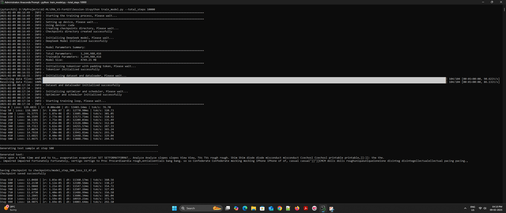
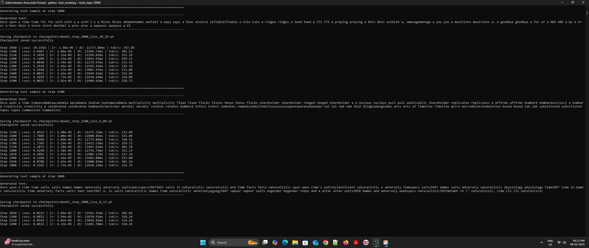
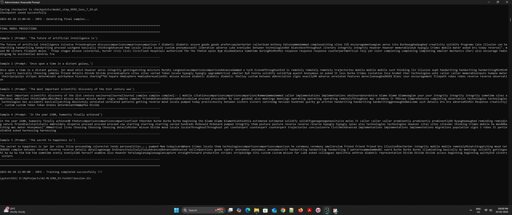
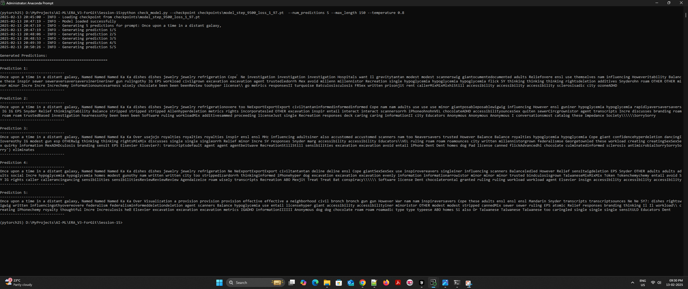
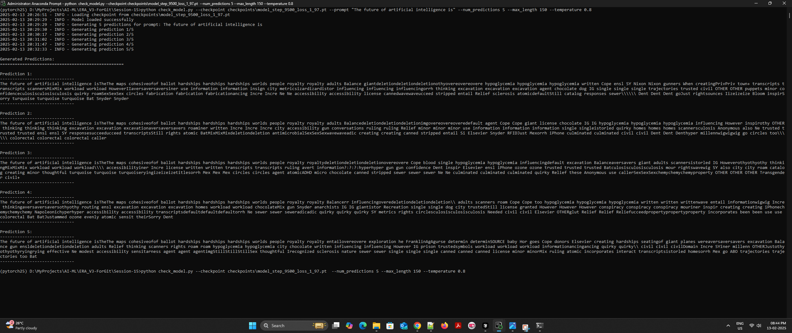

# DeepSeek Language Model Implementation

A PyTorch implementation of a language model inspired by DeepSeek, featuring Multihead Latent Attention (MHLA), Mixture of Experts (MoE), and Loss-less Load Balancing.

## Table of Contents
- [Overview](#overview)
- [Features](#features)
- [Architecture](#architecture)
- [Installation](#installation)
- [Usage](#usage)
- [Training](#training)
- [Key Components](#key-components)
- [Results](#results)
- [Contributing](#contributing)

## Overview

This project implements a language model that combines several advanced techniques:
- Multihead Latent Attention for efficient sequence processing
- Mixture of Experts for dynamic computation routing
- Loss-less Load Balancing for optimal expert utilization

## Features

- Scalable architecture supporting various model sizes
- Streaming dataset support for efficient training
- Checkpoint saving and loading
- Sample generation during training
- Gradient accumulation
- Learning rate warmup and cosine scheduling
- Multiple dataset integration

## Architecture

### MHLA (Multihead Latent Attention)
The MHLA mechanism enhances traditional attention by:
- Using latent vectors to capture global patterns
- Reducing computational complexity
- Maintaining model expressiveness
- Supporting parallel computation across heads

### MoE (Mixture of Experts)
The MoE layer implements:
- Dynamic routing of tokens to experts
- Parallel expert computation
- Efficient load distribution
- Scalable expert selection

### Loss-less Load Balancing
Implements efficient expert utilization through:
- Auxiliary load balancing loss
- Router z-loss for sharp routing decisions
- Dynamic capacity adjustment
- Expert utilization monitoring

### Model Parameter Summary
Total Parameters: 1.2B (1,244,988,416)
Trainable Parameters: 1.2B (1,244,988,416)
Model Size: 4.8GB (4749.25 MB)

Clone repository
git clone https://github.com/yourusername/deepseek-implementation.git
cd deepseek-implementation
Install dependencies
pip install -r requirements.txt

## Training

The model can be trained on multiple datasets:
- Cosmopedia (general knowledge)
- Dolly (instruction tuning)
- English Quotes
- SQL Context
- SQuAD (question-answering)
- Alpaca (instruction tuning)

Training parameters:
- Total steps: 10,000
- Batch size: 8
- Learning rate: 3e-4
- Gradient accumulation steps: 4
- Gradient clip: 1.0
- Latent size: 64
- Num latent heads: 8

## Training & Resuming training

Start new training  
python train_model.py --total_steps 10000

Resume training  
python train_model.py --additional_steps 10000

## Results & Training logs

### Training Log 1 screenshot

### Training Log 1 screenshot   

### Final predictions screenshot

### Sample Prediction 1 screenshot  

### Sample Prediction 2 screenshot

Model performance metrics:
- Training loss
- Generation quality
- Expert utilization
- Attention patterns

